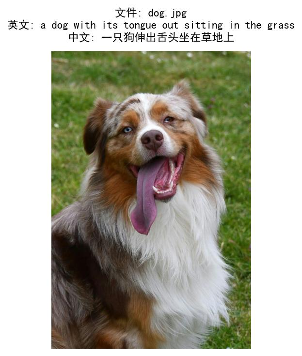

# BLIP 图像自动描述生成

基于 **Salesforce BLIP（Bootstrapping Language-Image Pre-training）** 的图像描述生成工具，支持单张/批量图片自动生成英文描述并翻译为中文，附带可视化结果。

## ✨ 项目特点
- 🚀 **开箱即用**：基于 Hugging Face Transformers，无需自己训练
- 🖼️ **单张/批量处理**：`caption.py`（单张）、`batch_caption.py`（批量）
- 🌐 **中英双语**：自动翻译英文描述为中文
- 📊 **可视化输出**：生成带图片+描述标注的结果图
- 💾 **结果归档**：自动保存文本日志与可视化图片

## 📦 环境依赖
```bash
conda create -n blip-caption python=3.9
conda activate blip-caption
pip install transformers pillow torch matplotlib googletrans==4.0.0-rc1
```
📁 项目结构
plaintext

blip-image-caption/

├── images/                # 测试图片目录（jpg/png/jpeg/bmp）

│   └── dog.jpg

├── caption.py             # 单张图片生成脚本

├── batch_caption.py       # 批量图片生成脚本

├── results.txt            # 批量结果日志（自动生成）

├── caption_result.jpg     # 单张结果图（自动生成）

└── result_*.jpg           # 批量结果图（自动生成）

🚀 快速运行
1. 准备图片
在 images/ 放入任意图片即可。
2. 单张图片生成
```bash
python caption.py
```
输出英文描述、中文翻译，并保存可视化结果。
3. 批量生成所有图片
```bash
python batch_caption.py
```
自动遍历 images/，批量生成并保存所有结果。

🧠 模型说明
使用 Salesforce/blip-image-captioning-base（ICML 2022）：

视觉编码器：ViT 提取图像特征

语言解码器：自回归生成自然语言描述

模型大小：约 900MB（首次运行自动下载缓存）


📝 效果示例
### 📝 效果示例

以下是部分图片的自动描述结果示例：

| 图片 | 英文描述 | 中文翻译 |
| :--- | :--- | :--- |
| 狗 | `a dog with its tongue out sitting in the grass` | 一只狗伸出舌头坐在草地上 |
| 小女孩 | `a little girl climbing on a climbing wall` | 一个小女孩在攀岩墙上攀爬 |
| 客厅 | `a living room with a couch, a table, and a television` | 客厅配有沙发、桌子和电视 |


⚠️ 注意事项

首次运行会自动下载模型，保持网络畅通  
GPU（CUDA）速度快，CPU 推理较慢（10–30 秒 / 张）  
翻译依赖网络，离线可替换本地翻译模型  
Windows 默认黑体，Linux/Mac 需配置中文字体  


🔮 未来拓展
结合 YOLO 做「目标检测 + 细节描述」  
支持中文直接生成  
离线翻译模块  
Web 在线生成界面  
